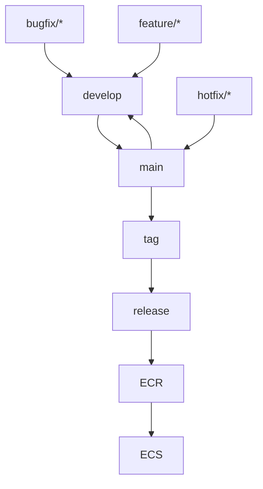

# Deployment to ECS with Github actions
# Github Action versions update, tagging, syncing branches and deployment
- Github action will create tags based on incoming branches feature/*, bugfix/* or hotfix/* branch is merged into master 
- When hotfix/* is merged it will increment version in package.json and will create tag with increment patch. 
    [] Also rebase the the develop branch on main
- When develop will be merged into main it will increment major branch version. 
    [] For Example, 1.0.2 to 2.0.0. 
- When feature/* or bugfix/* is merged it will increment major branch version and rebase develop branch on main
- Github action will create a release on latest tag.
- Finally, Github action will sync build to EC2 and ECS

## Git Workflow Diagram

## Set up ECR Repository
    Create a new ECR Repository
## Create ECS Instance
- Create Cluster
    - Select cluster template
      - EC2 Linux + Networking

## Github Secrets
Please add following secrets to run github actions:

Go to repository -> Settings -> Secrets and Variables -> Actions -> New repository secret

```
GH_PAT:<github_access_token>  
AWS_REGION: <aws_region>
AWS_S3_BUCKET: <s3_bucket>
AWS_ACCESS_KEY_ID: <aws_access_key_id>
AWS_SECRET_ACCESS_KEY: <aws_access_key_secret>
AWS_REGION:       
AWS_ACCESS_KEY_ID:       
AWS_SECRET_ACCESS_KEY:        
ECR_REGISTRY:        
ECR_REPOSITORY:
ECS_CLUSTER:        
ECS_SERVICE:        
ECS_TASK_DEFINITION: 
```

## Workflow permissions 
You need to turn on Read and write permissions to push tags to github repository. <br />
Settings -> Actions -> General -> Workflow permissions. <br />

- [x] Read and write permissions to push tags to github repository

<hr>

## How to run project

This repository gives example of streaming file upload to AWS S3 bucket and retrieving them from S3 bucket using Nest.js. Further, it will show how AWS S3 ACL works

## Pre-requisites 


## Install Dependencies

Create .env and past content .env.example file

Install nvm and run

```
nvm install
```
and 

```
nvm use

```
Install packages

```
npm install

```
## Set up local database

Run in the root of the project

```
docker-compose up 
```

# Access swagger 
Swagger will be at /api/v1/docs. If running locally then http://localhost:port/api/docs

# Author
Ali Anwar

